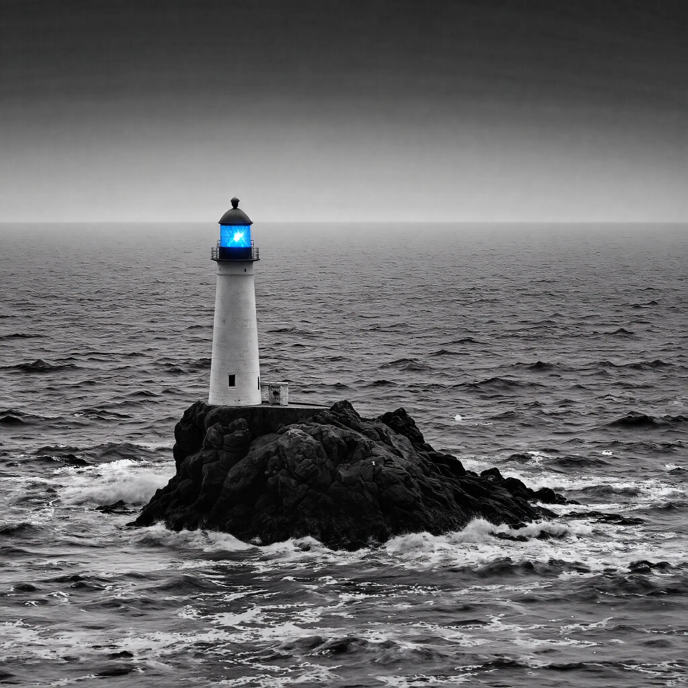

<!DOCTYPE html>
<html lang="ru">
<head>
<!-- Yandex.Metrika counter -->

<noscript>

</noscript>
<!-- /Yandex.Metrika counter -->
    <meta charset="UTF-8">
    <meta name="viewport" content="width=device-width, initial-scale=1.0">
    <title>Interstorm</title>
    <link rel="icon" href="favicon.ico" type="image/x-icon">
    <link href="https://fonts.googleapis.com/css2?family=Montserrat:wght@400;700&display=swap" rel="stylesheet">
    
</head>
<body>
    

        
INTERSTORM

        

            <h1>Помогаем производственным предприятиям зарабатывать больше</h1>
            <button id="mainButton">Перейти на главную страницу</button>
        

        
        

        <canvas id="lightningCanvas" style="position: absolute; top: 0; left: 0; width: 100%; height: 100%; pointer-events: none; z-index: 2;"></canvas>
    

    
</body>
</html>
